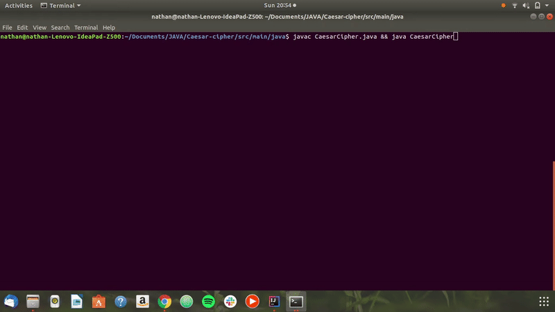

# Caesar Cipher

## By **Nathan Ng'ethe** Version: 1.0.

## Description
Caesar cipher is a simple app that allows yu to encrypt and decrypt your secret messages. Furthermore, you get the chance to choose the key by which your message is decrypted by. The app encrypts even spaces and numbers thus your message is as secure as possible.

## Features
* Encryption - Encrypt your words using an entered key.
* Decryption - Decrypt a message by the key which it was encrypted.

## Behaviour Driven Development(BDD)
| Project should handle : | Input example :     | Output example : |
| :------------- | :------------- | :-------------         |
| Encryption of words and spaces       | Stc:Hello there, Key:2       | Jgnnq"vjgtg    |
| Decryption of words and spaces       | Stc:Ikvjwd, Key:2      | Github    |
| Exiting the application       | Exit or 3       | The user exits the program    |

## Setup instructions
1. Clone or download the zipped folder of this repository.
2. Open the CaesarCipher.java file in the terminal and run `javac CaesarCipher.java && java CaesarCipher`.
   - This compiles and runs the application. Enjoy!!

## Demo

## Technologies used
- [Java](https://www.java.com/) - This was used to create the entire app especially in adding the encryption and decryption functionality.

## Known bugs
Accessing the project has a bug but to solve this click JAVA then Caesar-cipher folder and you will access all the project files.There are no other known bugs as of now. However, if you come across any, feel free to contact me.

## Contact Information
You can contact me via my gmail account at ngethenan768@gmail.com.

## License
The application is under an [MIT license](https://github.com/lendilai/Ceaser-Cipher/blob/master/LICENSE).